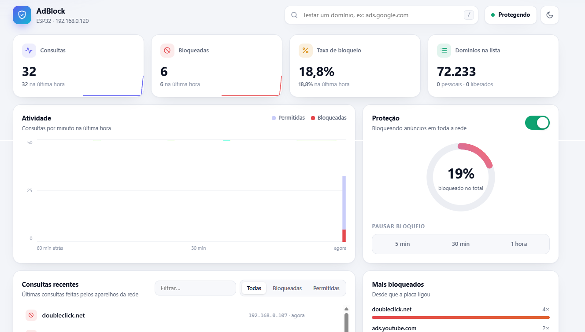
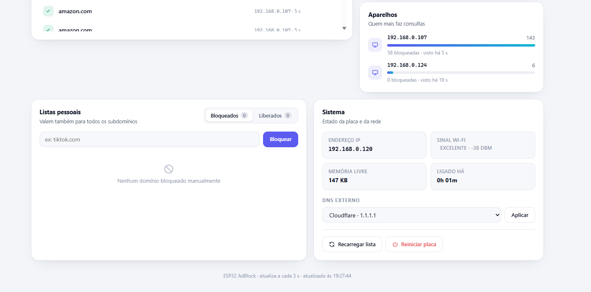
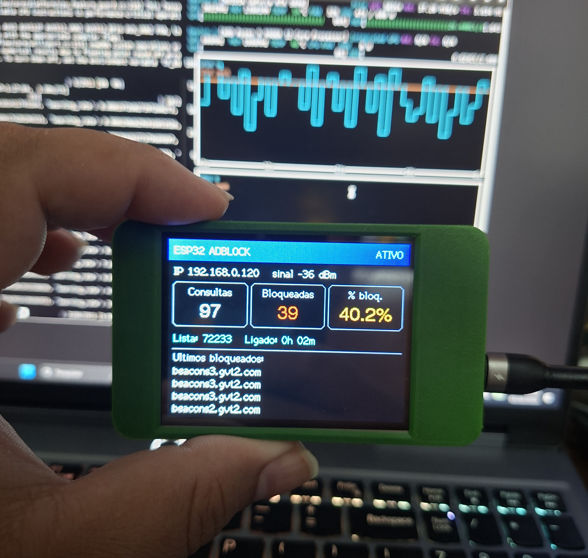
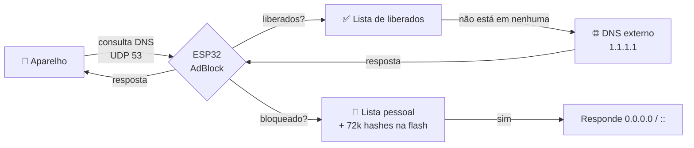
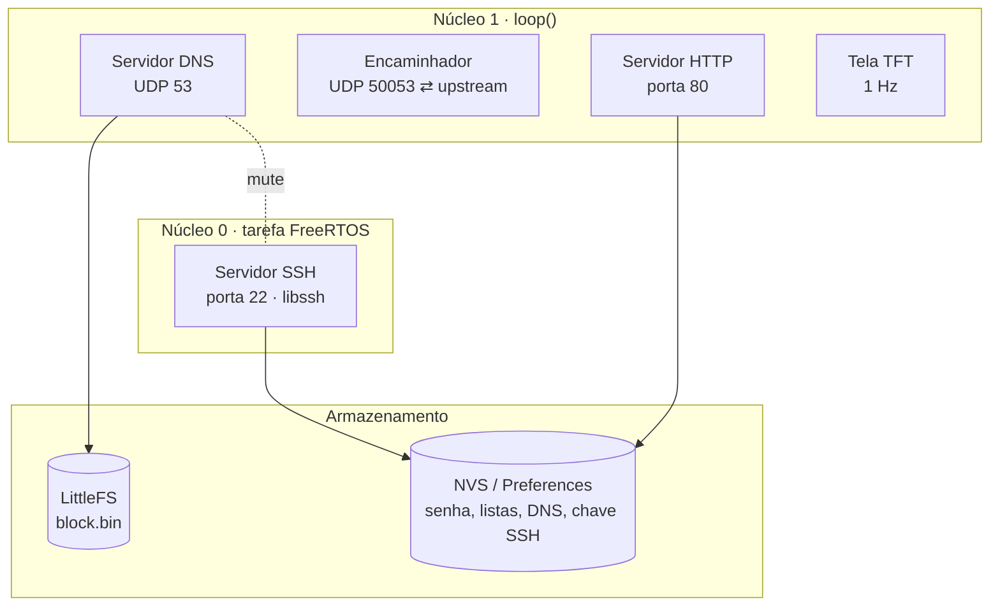

---

## ✨ Recursos

|                                      |                                                                                                                                                                |
| ------------------------------------ | -------------------------------------------------------------------------------------------------------------------------------------------------------------- |
| 🚫**Bloqueio na rede inteira** | Celulares, TVs, consoles e PCs ficam protegidos sem instalar nada: basta apontar o DNS do roteador para a placa.                                               |
| ⚡**Rápido e leve**           | Mais de 72 mil domínios ficam na flash como hashes ordenados. Cada consulta é resolvida com uma busca binária de ~17 leituras, sem carregar a lista na RAM. |
| 🌳**Bloqueia subdomínios**    | Se`doubleclick.net` está na lista, `ad.doubleclick.net` e `x.y.doubleclick.net` também são bloqueados.                                                |
| 📊**Dashboard web**            | Gráfico por minuto, ranking dos domínios mais bloqueados, aparelhos da rede, histórico ao vivo, tema claro/escuro e layout para celular.                    |
| 🖥️**Tela embarcada**         | Painel na própria placa (CYD 2.8") com estado, contadores e os últimos domínios bloqueados.                                                                 |
| 🔐**Console SSH**              | Servidor SSH nativo (libssh, chave Ed25519 gerada na placa) para administrar pelo terminal.                                                                    |
| 📝**Listas pessoais**          | Bloqueie ou libere domínios na hora. As listas ficam salvas na NVS e sobrevivem a reinícios.                                                                 |
| ⏸️**Pausa temporária**      | Desligue o bloqueio por 5 min, 30 min ou 1 h. Ele volta sozinho.                                                                                               |

---

## 📸 Capturas

### Dashboard web





### Tela embarcada




---

## ⚙️ Como funciona

A ESP32 vira o **servidor DNS da rede**. Cada aparelho pergunta a ela "qual é o IP de `ads.exemplo.com`?". Se o domínio estiver na lista, ela responde `0.0.0.0` e o anúncio nunca carrega. Se não estiver, ela repassa a pergunta a um DNS público (Cloudflare, Google…) e devolve a resposta.



### Ordem de decisão

```
1. Lista de liberados (allow)       → sufixo bate?  → PERMITE
2. Lista pessoal de bloqueio        → sufixo bate?  → BLOQUEIA
3. Lista principal (block.bin)      → hash bate?    → BLOQUEIA
4. Nenhuma                          →               → REPASSA ao DNS externo
```

Todas as verificações sobem pelos domínios pai: `a.b.ads.com` testa `a.b.ads.com`, depois `b.ads.com` e depois `ads.com`. O TLD sozinho (`com`) nunca é testado.

### Arquitetura do firmware



O DNS, a tela e o HTTP rodam no **núcleo 1**, num loop não bloqueante. O SSH fica isolado numa tarefa FreeRTOS no **núcleo 0**, então uma sessão de terminal aberta não atrasa as consultas da rede. O estado compartilhado (listas, log, estatísticas) é protegido por um mutex.

### Detalhes técnicos

<details>
<summary><b>🔎 Lista de bloqueio: hashes FNV-1a + busca binária</b></summary>

<br>

O script `build_blocklist.py` baixa listas no formato *hosts*, *AdBlock* (`||dominio^`) ou um domínio por linha, normaliza (minúsculas, sem ponto final) e gera `data/block.bin`:

```
block.bin = [ uint32 LE ] [ uint32 LE ] [ uint32 LE ] ...   (ordenado, sem repetição)
             FNV-1a(dom)   FNV-1a(dom)   FNV-1a(dom)
```

| Métrica                         | Valor                                            |
| -------------------------------- | ------------------------------------------------ |
| Domínios (StevenBlack, padrão) | ~72 000                                          |
| Tamanho do arquivo               | ~282 KB (4 bytes por domínio)                   |
| Capacidade (`--max`, padrão)  | 180 000 domínios, ~720 KB                       |
| Custo da consulta                | ⌈log₂ n⌉ ≈ 17 leituras de 4 bytes na flash   |
| RAM usada pela lista             | ~0 (o arquivo fica aberto e é lido com`seek`) |
| Falso positivo por verificação | ≈ n / 2³² ≈ 0,0017%                          |

Como os 72 mil domínios em texto não caberiam nos ~320 KB de RAM da ESP32, a placa guarda só o hash de 32 bits de cada um. Uma colisão rara pode bloquear um site legítimo, e o comando `allow` resolve isso na hora.

</details>

<details>
<summary><b>📡 Servidor DNS</b></summary>

<br>

- **Consulta bloqueada:** a placa responde ela mesma, com `RA=1` e `NOERROR`:
  - `A` → `0.0.0.0` e `AAAA` → `::`, com TTL de 60 s;
  - outros tipos (`HTTPS`, `TXT`…) → resposta vazia (NODATA).
- **Consulta permitida:** o pacote é repassado ao DNS externo com um **ID de transação aleatório** (`esp_random()`), para dificultar respostas forjadas. A resposta só é aceita se vier do IP do DNS configurado e com um ID pendente. Até 64 consultas podem estar em andamento ao mesmo tempo.
- **Validação:** QNAMEs com ponteiros de compressão, rótulos inválidos ou mais de 253 caracteres são descartados.

</details>

<details>
<summary><b>📊 Telemetria em memória</b></summary>

<br>

| Estrutura      | Tamanho     | Uso                                                |
| -------------- | ----------- | -------------------------------------------------- |
| Log circular   | 50 entradas | domínio, bloqueado?, IP do cliente, horário      |
| Histograma     | 60 × 1 min | gráfico "Atividade"                               |
| Top bloqueados | 24 slots    | ranking aproximado (troca o de menor contagem)     |
| Aparelhos      | 16 slots    | consultas e bloqueios por IP (troca o mais antigo) |

Tudo fica em RAM (~6 KB) e zera ao reiniciar. Nada é gravado na flash, para não desgastá-la.

</details>

<details>
<summary><b>💾 Uso de memória e partições</b></summary>

<br>

| Recurso                  | Uso                                               |
| ------------------------ | ------------------------------------------------- |
| Flash do firmware        | ~1,27 MB de 3 MB (`huge_app.csv`)               |
| RAM estática            | ~67 KB (20%)                                      |
| Heap livre em operação | ~145 KB                                           |
| LittleFS (lista)         | 896 KB (partição`spiffs` do `huge_app.csv`) |
| Pilha da tarefa SSH      | 50 KB                                             |

</details>

---

## 🧰 Hardware

| Item                        | Detalhes                                                                                                     |
| --------------------------- | ------------------------------------------------------------------------------------------------------------ |
| **Placa recomendada** | **ESP32-2432S028R** ("Cheap Yellow Display", CYD): ESP32-WROOM-32 + tela ILI9341 2.8" 320×240 + touch |
| Alternativa                 | Qualquer ESP32 com 4 MB de flash. A tela é opcional, e o firmware funciona sem ela.                         |
| Rede                        | Wi-Fi**2.4 GHz** (a ESP32 não suporta 5 GHz)                                                          |
| Alimentação               | USB 5 V                                                                                                      |

<details>
<summary>Pinagem da tela (já configurada no <code>platformio.ini</code>)</summary>

| Sinal              | GPIO          |
| ------------------ | ------------- |
| MOSI / MISO / SCLK | 13 / 12 / 14  |
| CS / DC / RST      | 15 / 2 / —   |
| Backlight          | 21            |
| Barramento         | HSPI @ 55 MHz |

> Se a tela ficar branca ou com as cores trocadas, sua CYD provavelmente usa o controlador ST7789. Troque `-DILI9341_2_DRIVER=1` por `-DST7789_DRIVER=1`.

</details>

---

## 🚀 Instalação

### Pré-requisitos

```bash
pip install platformio
```

### 1. Configure

Edite o bloco de configuração no topo de [`src/main.cpp`](src/main.cpp):

```cpp
const char* WIFI_SSID = "MinhaRede-2.4G";       // precisa ser 2.4 GHz
const char* WIFI_PASS = "minha-senha";

#define USE_STATIC_IP 1                          // 0 = DHCP (faça reserva no roteador)
IPAddress LOCAL_IP(192, 168, 0, 120);            // IP fixo da placa (livre na sua rede)
IPAddress GATEWAY(192, 168, 0, 1);               // IP do roteador
IPAddress SUBNET(255, 255, 255, 0);

const char* SSH_USER         = "admin";
const char* DEFAULT_SSH_PASS = "admin";          // troque no primeiro acesso!
const char* DEFAULT_UPSTREAM = "1.1.1.1";        // DNS externo
```

> 💡 Para descobrir o gateway e a faixa da sua rede, rode `ipconfig` (Windows) ou `ip route` (Linux) e veja o **Gateway Padrão**. O `LOCAL_IP` deve ficar na mesma faixa e **nunca** ser igual ao gateway.

### 2. Gere a lista de bloqueio

```bash
python build_blocklist.py
```

Listas extras podem ser somadas:

```bash
python build_blocklist.py \
  https://raw.githubusercontent.com/StevenBlack/hosts/master/hosts \
  https://adaway.org/hosts.txt \
  --max 180000
```

### 3. Grave na placa

```bash
python -m platformio run -t uploadfs     # envia data/block.bin para o LittleFS
python -m platformio run -t upload       # grava o firmware
python -m platformio device monitor      # (opcional) acompanha o boot
```

Saída esperada:

```
Tela iniciada
Lista principal: 72233 dominios
Conectando ao Wi-Fi........
Conectado. IP: 192.168.0.120
Interface web: http://192.168.0.120/
Impressao digital SSH: SHA256:...
SSH ouvindo na porta 22
```

### 4. Aponte a rede para a placa

No painel do seu roteador:

1. **DHCP → DNS primário:** `192.168.0.120`
2. **Reserve** esse IP para a ESP32, ou deixe-o fora da faixa do DHCP.
3. **IPv6:** desative o DNS IPv6 (RDNSS/DHCPv6) na LAN. Sem isso, os aparelhos usam o DNS IPv6 do roteador e passam por fora do bloqueio.

Reconecte os aparelhos ao Wi-Fi (ou espere renovar o DHCP) e pronto.

> ⚠️ Navegadores com **"DNS seguro"** (Chrome, Edge, Firefox) e o **"DNS privado"** do Android ignoram o DNS da rede. Desative essas opções para o bloqueio funcionar nesses aparelhos.

### 5. Teste

```bash
nslookup doubleclick.net 192.168.0.120     # → 0.0.0.0  (bloqueado)
nslookup google.com 192.168.0.120          # → IP real   (permitido)
```

---

## 🌐 Interface web

Acesse **`http://192.168.0.120`** e entre com o mesmo usuário e senha do SSH.

| Seção                               | O que faz                                                                                     |
| ------------------------------------- | --------------------------------------------------------------------------------------------- |
| **Cabeçalho**                  | Teste de domínio com ação rápida (atalho<kbd>/</kbd>), estado ao vivo e tema claro/escuro |
| **Métricas**                   | Consultas, bloqueadas, taxa e tamanho da lista, com minigráficos                             |
| **Atividade**                   | Barras empilhadas por minuto (60 min), com detalhes ao passar o mouse                         |
| **Proteção**                  | Liga/desliga, anel com a % bloqueada e pausa de 5 min, 30 min ou 1 h com contagem regressiva  |
| **Consultas recentes**          | Filtro por texto e status. Bloqueie ou libere direto da linha                                 |
| **Mais bloqueados / Aparelhos** | Rankings em tempo real                                                                        |
| **Listas pessoais**             | Adicione ou remova domínios bloqueados e liberados                                           |
| **Sistema**                     | IP, sinal, memória, tempo ligado, troca do DNS externo, recarregar a lista e reiniciar       |

A página tem ~45 KB, sem dependências externas (HTML, CSS e JS puros, embutidos no firmware em [`src/web_page.h`](src/web_page.h)), e atualiza a cada 3 s.

---

## 🔐 Console SSH

```bash
ssh admin@192.168.0.120
```

```text
ESP32 AdBlock - digite help
> status
Bloqueio: ATIVO
Consultas: 1532 | bloqueadas: 412 (26.9%)
Lista principal: 72233 | pessoal: 3 | liberados: 1
DNS externo: 1.1.1.1
IP: 192.168.0.120 | sinal: -38 dBm
Memoria livre: 146208 bytes
Ligado ha: 5h 12m
```

| Comando                                       | Descrição                                        |
| --------------------------------------------- | -------------------------------------------------- |
| `status`                                    | Estatísticas e estado                             |
| `on` / `off`                              | Liga ou desliga o bloqueio                         |
| `pause <min>`                               | Pausa por N minutos (padrão 5)                    |
| `check <domínio>`                          | Diz se o domínio seria bloqueado e por qual lista |
| `block <domínio>` / `unblock <domínio>` | Lista pessoal de bloqueio (inclui subdomínios)    |
| `allow <domínio>` / `unallow <domínio>` | Lista de liberados (vence as outras listas)        |
| `list block` / `list allow`               | Mostra as listas pessoais                          |
| `log`                                       | Últimas 32 consultas                              |
| `upstream <ip>`                             | Troca o DNS externo                                |
| `reload`                                    | Recarrega o`/block.bin`                          |
| `passwd <senha>`                            | Troca a senha do SSH e da web (mín. 8 caracteres) |
| `reboot`                                    | Reinicia a placa                                   |
| `exit`                                      | Encerra a sessão                                  |

Também dá para rodar um comando só: `ssh admin@192.168.0.120 status`.

---

## 🔌 API HTTP

Todas as rotas exigem **HTTP Basic Auth** (mesmo usuário e senha do SSH).

| Método  | Rota            | Descrição                                                                   |
| -------- | --------------- | ----------------------------------------------------------------------------- |
| `GET`  | `/`           | Dashboard                                                                     |
| `GET`  | `/api/status` | Estado completo em JSON                                                       |
| `POST` | `/api/cmd`    | Executa um comando do console (`c=<comando>`). Exige o cabeçalho `X-Req` |

```bash
curl -u admin:SENHA http://192.168.0.120/api/status

curl -u admin:SENHA -H "X-Req: 1" --data-urlencode "c=block tiktok.com" \
     http://192.168.0.120/api/cmd
```

<details>
<summary>Formato de <code>/api/status</code></summary>

```jsonc
{
  "state": "ATIVO",            // ATIVO | PAUSADO | DESLIGADO
  "pause": 0,                  // segundos restantes de pausa
  "total": 1532, "blocked": 412,
  "list": 72233,               // domínios na lista principal
  "upstream": "1.1.1.1", "ip": "192.168.0.120",
  "rssi": -38, "heap": 146208, "uptime": 18720,
  "cblock": ["tiktok.com"],    // lista pessoal
  "allow":  ["exemplo.com"],   // liberados
  "log":     [["ads.exemplo.com", 1, "192.168.0.107", 4]],   // domínio, bloqueado, IP, s atrás
  "hist":    [[12, 3], [30, 9]],                             // 60 × [consultas, bloqueadas]
  "top":     [["doubleclick.net", 42]],                      // domínio, vezes
  "clients": [["192.168.0.107", 900, 210, 2]]                // IP, consultas, bloqueadas, s atrás
}
```

</details>

> O cabeçalho `X-Req` em `/api/cmd` impede que **outro site** aberto no seu navegador dispare comandos usando o login salvo (proteção contra CSRF).

---

## 🗂️ Estrutura do projeto

```
esp32-adblock/
├── src/
│   ├── main.cpp            # DNS, encaminhador, tela, HTTP, SSH, console
│   └── web_page.h          # dashboard (HTML/CSS/JS embutido em PROGMEM)
├── build_blocklist.py      # baixa as listas e gera data/block.bin
├── platformio.ini          # placa, partições, bibliotecas e pinos da tela
├── data/                   # (gerado) block.bin → LittleFS
└── assets/                 # imagens do README
```

---

## 🩺 Problemas comuns

| Sintoma                            | Causa provável                         | Solução                                                                                                        |
| ---------------------------------- | --------------------------------------- | ---------------------------------------------------------------------------------------------------------------- |
| Fica em`Conectando ao Wi-Fi....` | Rede 5 GHz ou senha errada              | Use a rede 2.4 GHz. Depois de 20 s, a serial lista as redes visíveis e o código de erro (`status 4` = senha) |
| Tela apagada                       | Firmware de outro projeto gravado       | Grave de novo com`python -m platformio run -t upload`                                                          |
| Tela branca / cores estranhas      | CYD com ST7789                          | Troque o driver no`platformio.ini`                                                                             |
| `Lista principal: 0 dominios`    | `block.bin` não foi enviado          | `python build_blocklist.py` e `-t uploadfs`                                                                  |
| Anúncios continuam aparecendo     | DNS IPv6, DNS seguro ou cache           | Veja o passo 4. Reconecte o aparelho para limpar o cache                                                         |
| Um site legítimo quebrou          | Domínio na lista (ou colisão de hash) | `check site.com` e depois `allow site.com`                                                                   |
| `Connection refused` no SSH      | Placa fora do ar ou IP diferente        | Confira o IP na tela da placa                                                                                    |

---

## ⚠️ Limitações e segurança

- **Sem DNS sobre TCP:** respostas muito grandes (bit TC) não são reenviadas por TCP. Isso é raro no uso doméstico.
- **A web usa HTTP sem TLS:** use só na rede local e **nunca** exponha as portas 80/22 para a internet.
- **Credenciais no código:** não publique o `main.cpp` com sua senha real do Wi-Fi. Troque a senha padrão com `passwd` no primeiro acesso.
- **Estatísticas voláteis:** o gráfico, os rankings e o log zeram ao reiniciar.

---

## 🙏 Créditos

- [StevenBlack/hosts](https://github.com/StevenBlack/hosts): lista de bloqueio padrão
- [LibSSH-ESP32](https://github.com/ewpa/LibSSH-ESP32): port do libssh para a ESP32
- [TFT_eSPI](https://github.com/Bodmer/TFT_eSPI): driver da tela
- Inspirado no [Pi-hole](https://pi-hole.net/)

<div align="center">
<br>
<sub>Feito com ☕ e uma ESP32</sub>
</div>

### By Reyner Alegria @reyneralegria13
